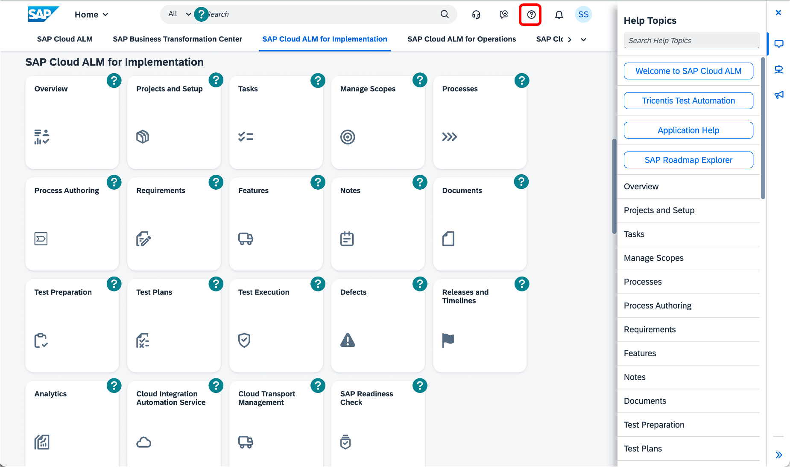
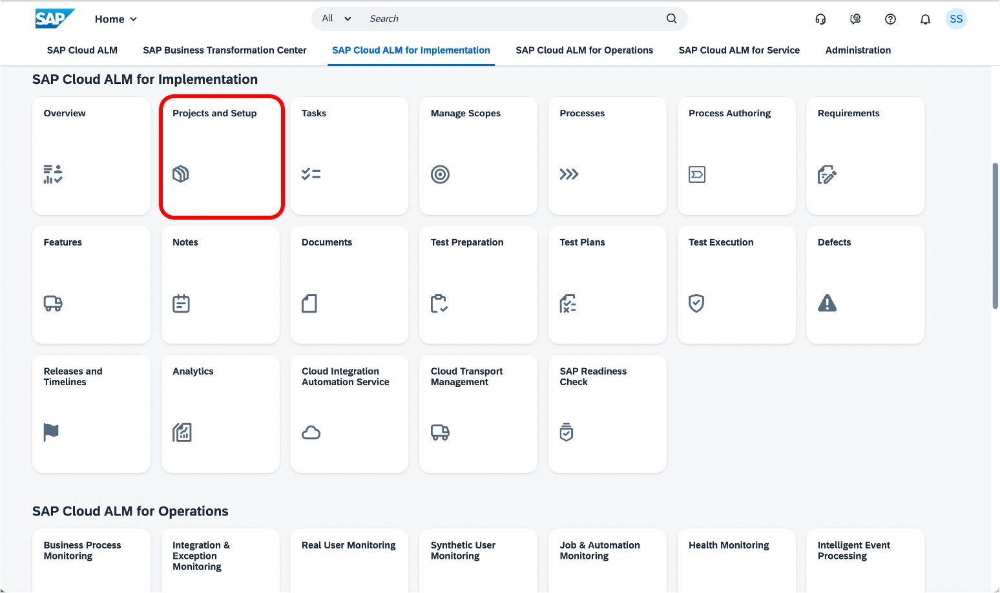
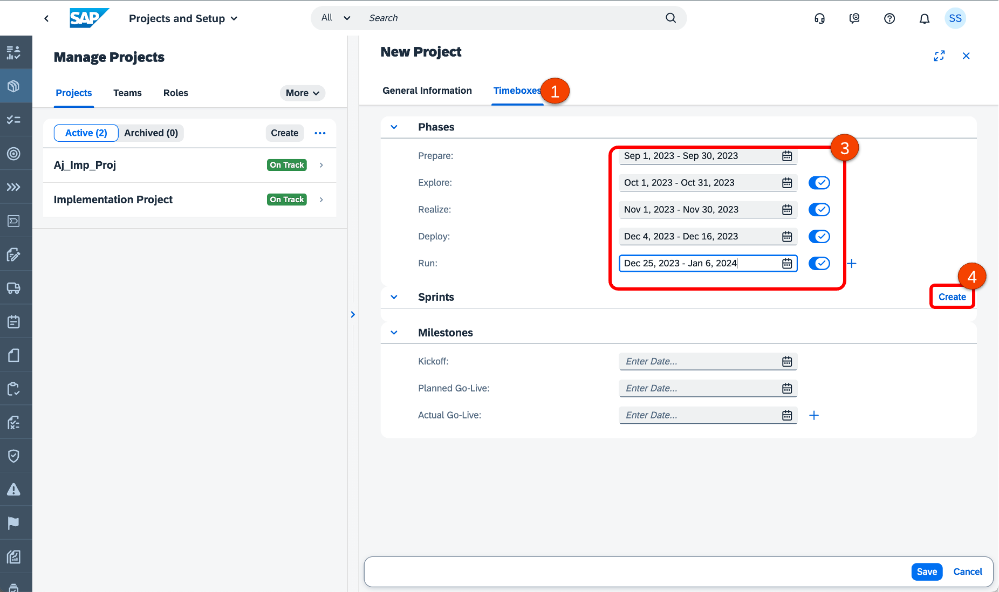
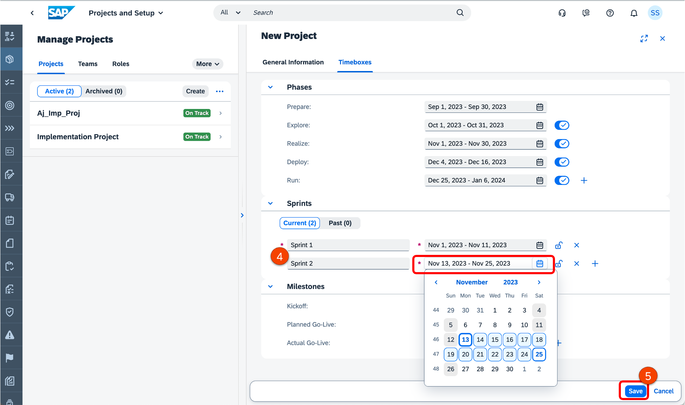

# Exercise 1: Create project & maintain project timelines
In this exercise, we will create a Project and maintain the project timeline (Timeboxes).
We will begin many of the exercises from the Fiori launchpad. When you are within any application, you can click on the SAP Logo to return to Fiori Launchpad
An integrated help assistant is also available in SAP Cloud ALM. 

Click on Question Mark (Open Help). Help topics open by default.

## Exercise 1.1 Create new project

1. Click **Projects and Setup**

1. Click **Create** button.
2. Enter the Project title: **TECHED2023_DT165_XX with (XX = your user ID)**
3. Select **SAP S/4HANA Cloud, private edition - implementation** as roadmap in the field SAP Activate Roadmap selection.
4. Set Access Level as **Public**.
5. Click **Save**.

## Exercise 1.2 Define Timeboxes (Project Phases & Sprints)

In this step, you define the different Timelines of Phases, Sprints or Milestones.

1. Click on the **Timebox** Tab
2. Click on **Edit**
3. Enter the planned dates for your phases.
4. Start creating some sprints for your Project (e.g. bi-weekly sprints in REALIZE phase).
5. Make sure you save the Project.

## Summary

You have now setup your project.

Continue to [Exercise 2](../EX2/EXCERCISE_2.md)

