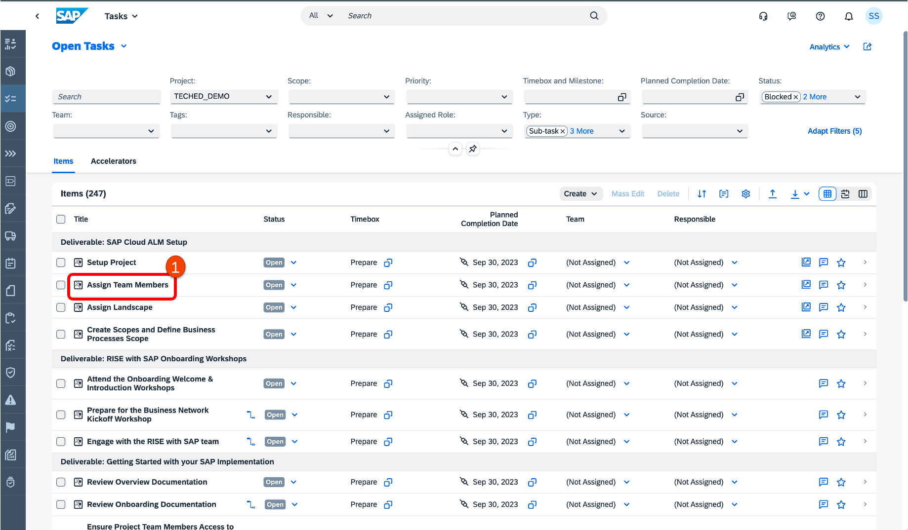
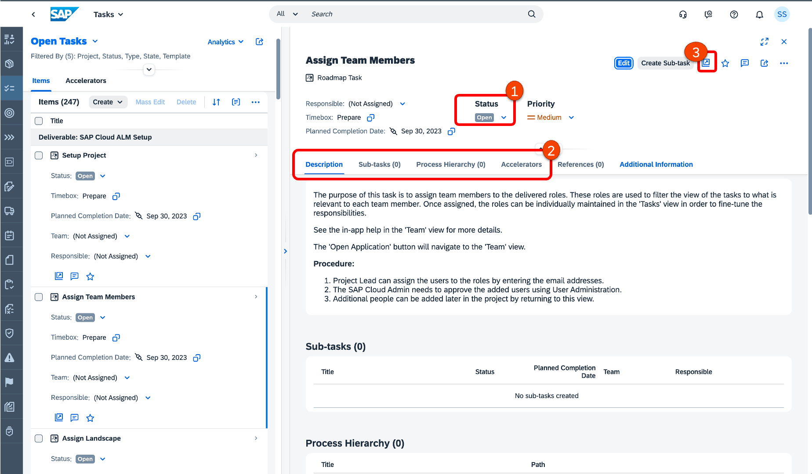
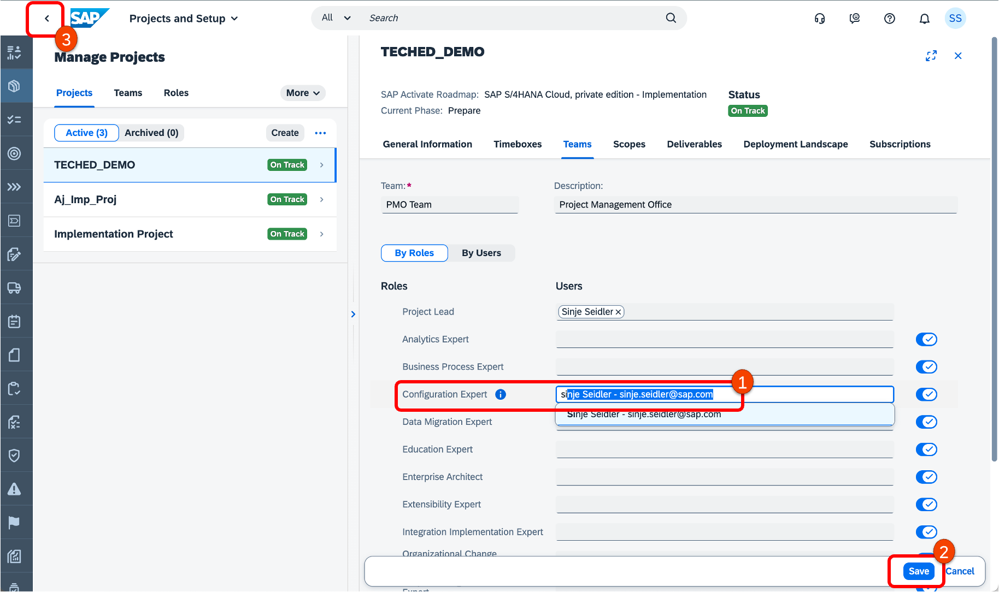
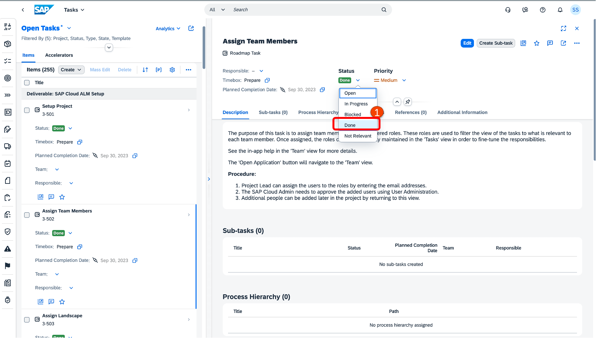
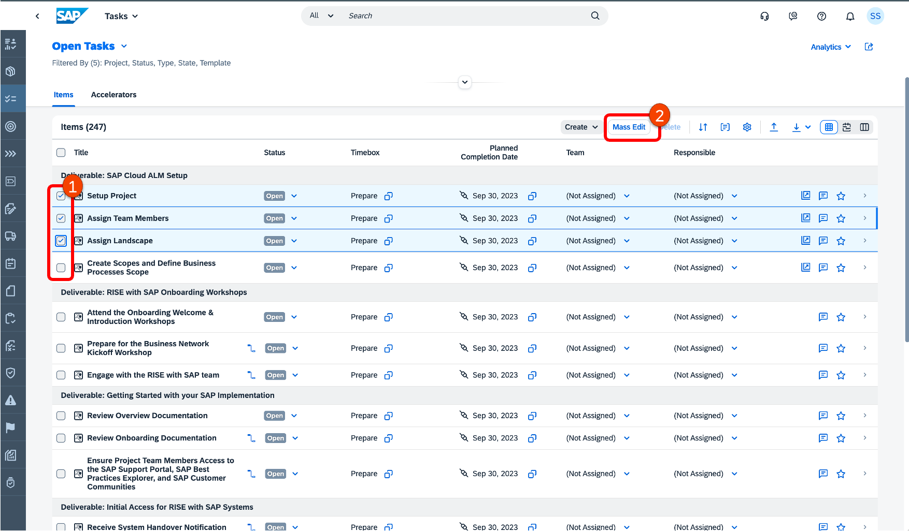
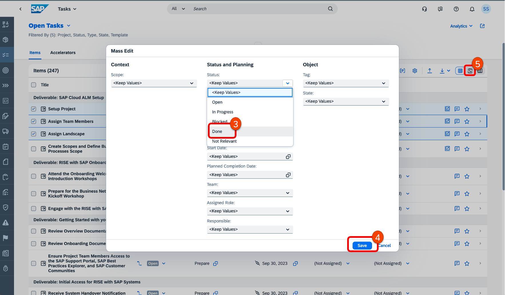
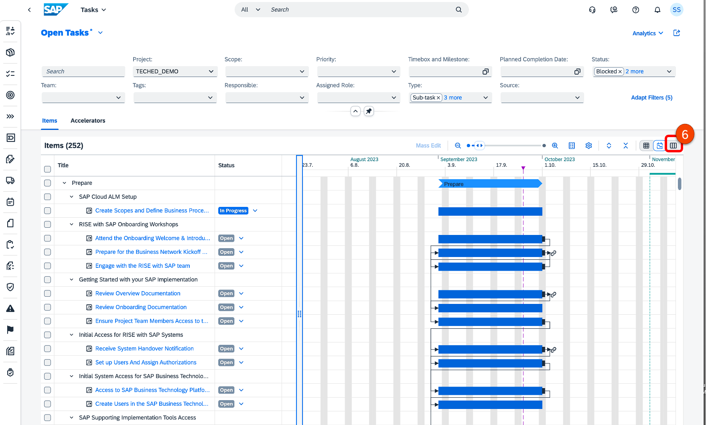
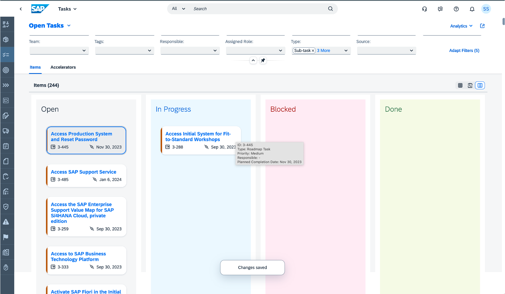

# Exercise 2 - Manage and Execute Tasks

The purpose of this exercise is to manage and execute tasks of the project.

## Exercise 2.1 Project Overview
The overview page provides a high-level overview of progress in different areas. It acts like a health check monitor for projects, and at the same time, it provides connectivity to other applications for a faster drill-down. Each card on the overview page represents a specific topic and displays set of relevant KPIs.

1. Navigate to the **Project Overview page**
2. Select the Project you just created in the previous exercise
3. You can view all the upcoming tasks by clicking on the card title **Upcoming Tasks**. This takes you to Open Tasks page.
   

1. Click on the task that needs to be performed. For example: **Assign Team Members**.
   

1. In this screen, you can assign a **Responsible person**, or change the planned completion date, status, and priority. For example, change the status to **In Progress**.
2. All the content, such as descriptions, available accelerators, etc., is also available here.
3. Proceed to the actual app to perform the task by clicking the link as shown above. You are taken back to the project setup page.

## Exercise 2.2 Maintain Tasks

In this part we want to assign users to project teams and roles.
**CAUTION: This is not a productive SAP Cloud ALM environment. We are here in a shared demo environment, and personal information can be seen by others. Please do not enter any personal data, e.g., E-Mail addresses. Thank You!**

1. Click on Edit and assign your user as a **Configuration Expert**.
2.**Save** the details.
3. Use the Back button **(<)** to go back to the task.

1. Set the task status to **Done** to indicate that the team members are assigned.
   
## Exercise 2.3 Mass Edit of tasks
In SAP Cloud ALM you can mass maintain attributes in the list view.

1. Select a couple of tasks (3-4 as shown in the screenshot)
2. Click on **Mass Edit**
3. Change the status to **Done**
4. **Save** the details.

5. Click on **Gantt Chart** button.

## Exercise 2.4 Card View
1. Go to **Cards View**.
2. Select a task and drag & drop the tasks in the **In Progress** column.

   
## Summary

You've now learned different ways to view and maintain tasks in SAP Cloud ALM.

Continue to [Exercise 3](../EX3/EXCERCISE_3.md)

