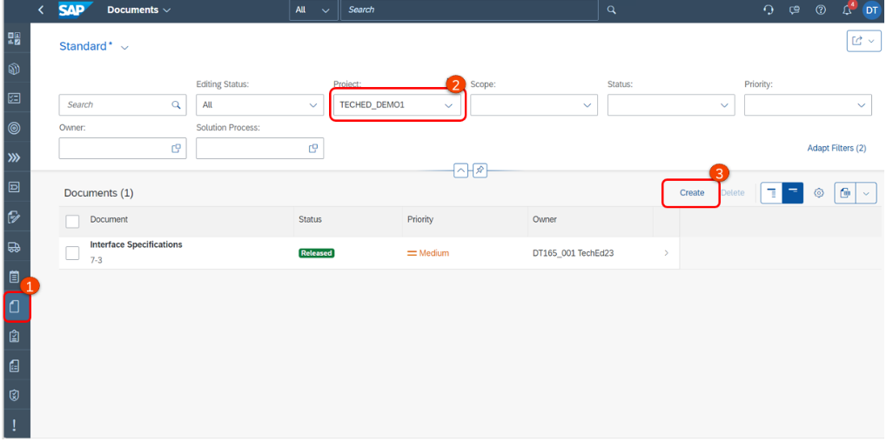
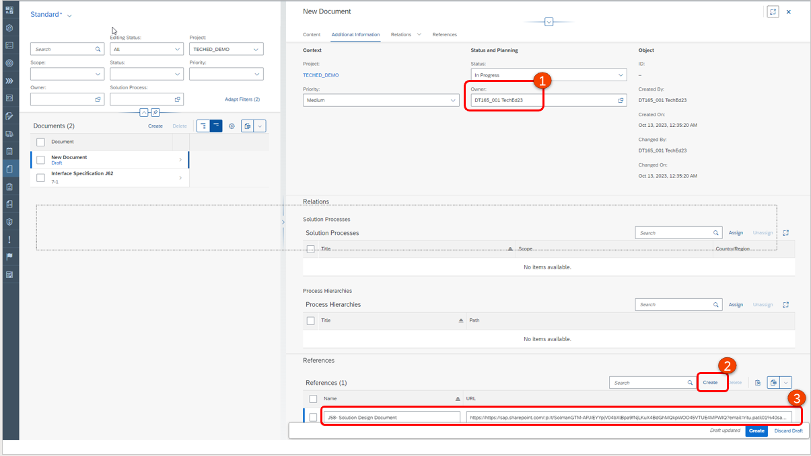
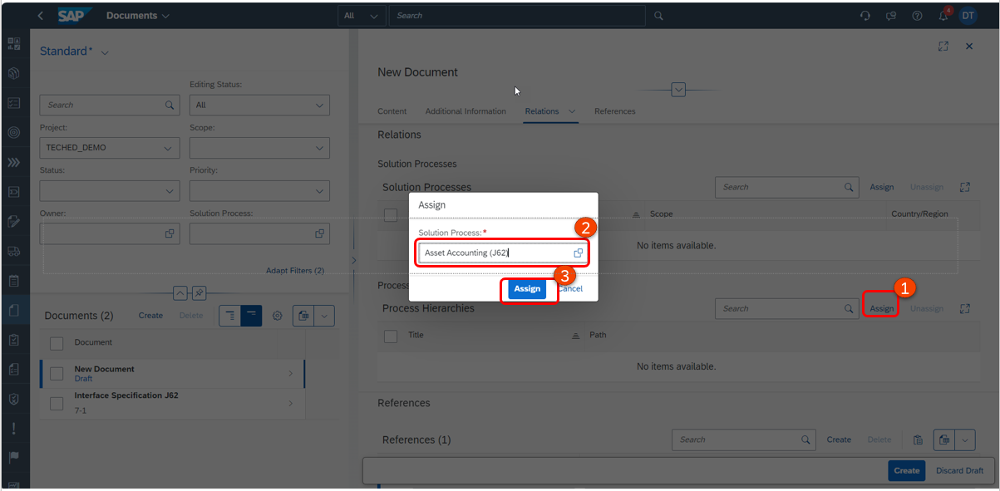
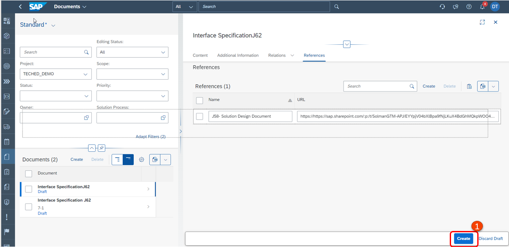
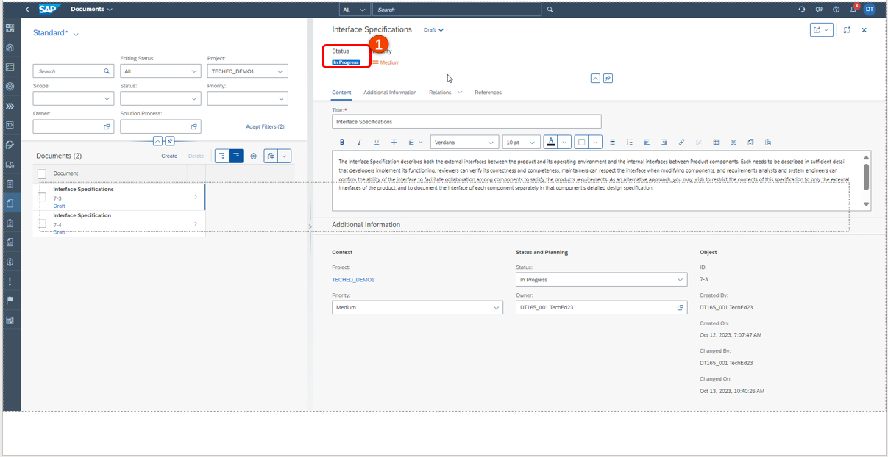
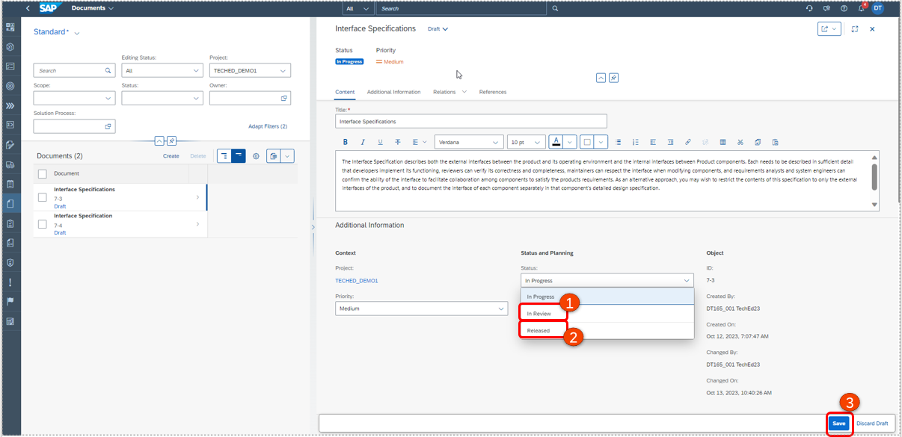

# Excercise 3: Create Scopes and Define Business Processes
The purpose of this task is to create a Project Scope and selected the processes that are part of this implementation scope.
A scope is a container for solution processes or variants that should be managed collectively. During scoping, you add solution processes to your scopes to define the project process scope.

## Excercise 3.1 Create Project Scope

1. Navigate back to the **Project Overview** page.
   

1. Under Upcoming Open the task **Create Scopes and Define Business Process Scope** by clicking on the link.

1. Change the Status of the task to **In Progress**.
2. Click on the link to navigate to **Solution Process Scope**.

1. Click on **Manage Scope**.

NOTE: If you already have a list of your selected scope items available, e.g., from your Digital Discovery Assessment (DDA) Report, you can expedite the creation of your scopes in SAP Cloud ALM.
But you can just create your own Excel to import the scope into SAP Cloud ALM.

1. Click on **Create > Scope**

1. Create a new scope called: **TechEd Scope <Your UserID>**.
2. Use the search bar to search for **SAP Best Practices for SAP S/4HANA Cloud, public edition – version 2308** and use the toggle button to select this.
3. Save and confirm the pop up.

1. Click on **Process Scoping**.

## Excercise 3.2 Select Business Processes

After selecting the solution scenarios, we can now select the individual processes that are in scope.
1. Use filters such as **Country = India**
2. and **Business Process Group = Finance** to narrow down the solution processes.
3. Use the toggle button to include a solution process into scope.

For this exercise, include the below solution processes:
**- Accounting and Financial Close (J58)**
**- Accounts Payable (J60)**
**- Accounts Receivable (J59)**
**- Asset Accounting (J62)**

4. Click on **End scoping**.

Continue to [Exercise 4](../EX4/EXCERCISE_4.md)
