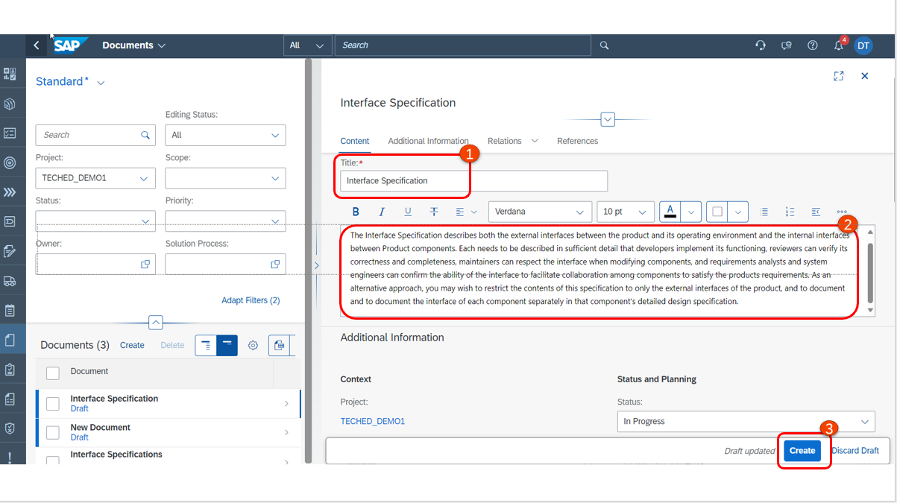
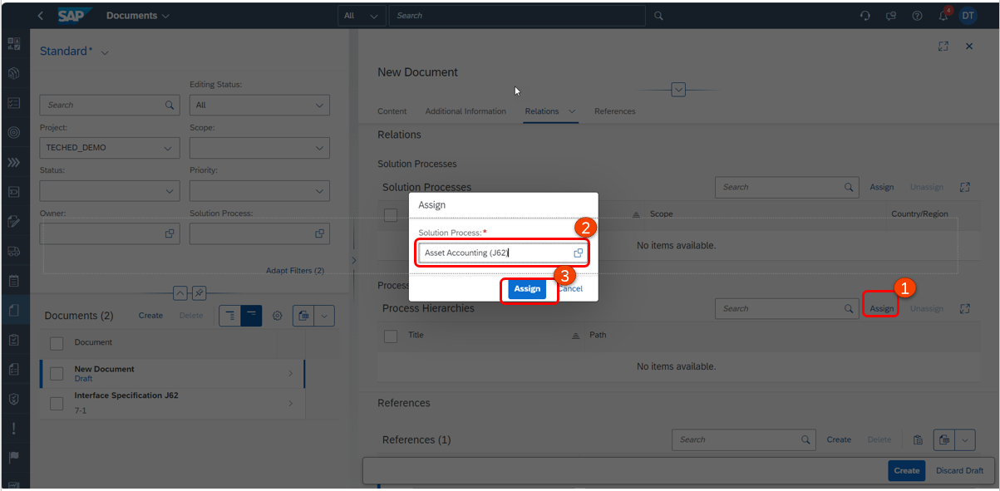
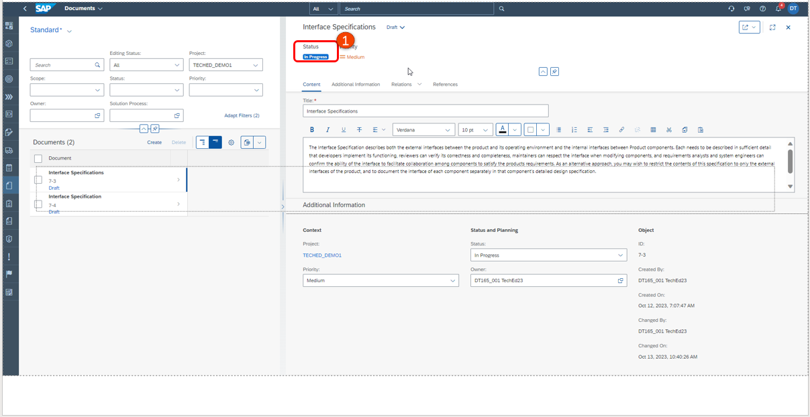
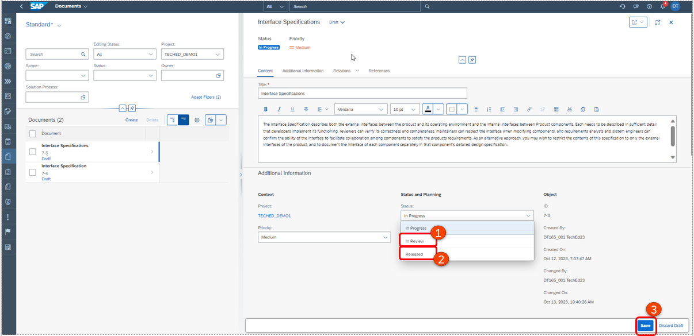

# Exercise 7: Manage Documentation 

## Create Documents 

1. Go to Documents app. 
2. Ensure that the correct project is chosen. 
3. Click on **Create**.

1. Provide a document **title**. 
2. Use the rich text editor to start documenting. 

1. By default, the name of the creator is taken over as the **owner** of the document.  
2. Here you can maintain the URL where the external Document is located and name the reference and Click on **Create**.
3. Maintain the **URL** and the **name** for the external document if needed.

The ‘Document’ element can be related to Solution Processes. This can be maintained under **Relations**, selecting one or more Solution Processes the Document belongs to. 
1. Click on **Assign**. 
2. Choose the solution process.  
3. Click on Assign.

1. Click on **Create**.

1. Document is created with status **In Progress**.

1. Change the document status to **In Review** to indicate that the document is being reviewed. 
2. Once review is completed, change the status to **released**. 
3. Finally **Save** the Document. 

## Summary 

You have learned how to use document management capability in SAP Cloud ALM. 

Continue to [Exercise 8](../EX8/EXCERCISE_8.md)

