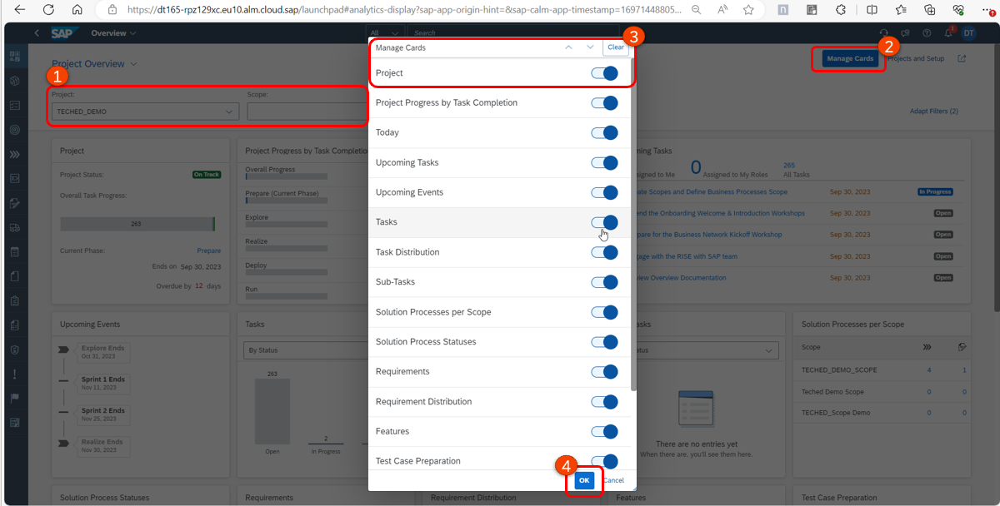
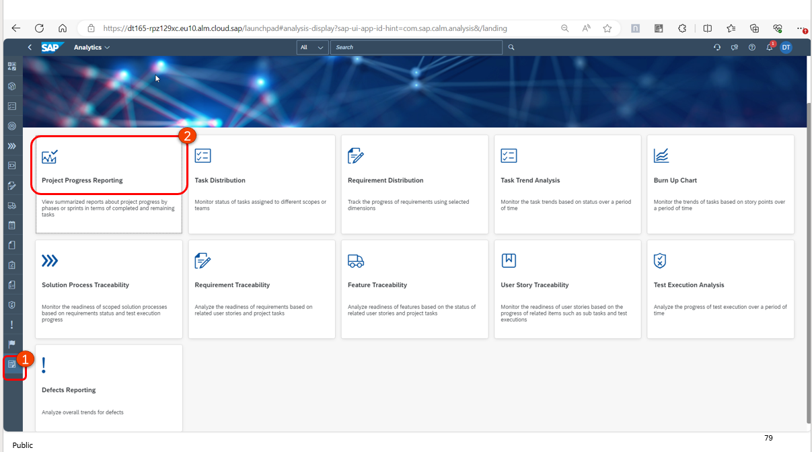
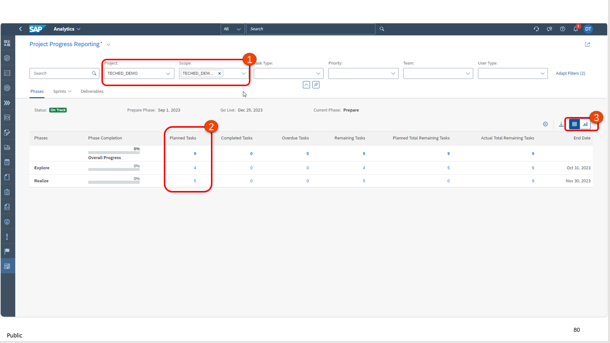
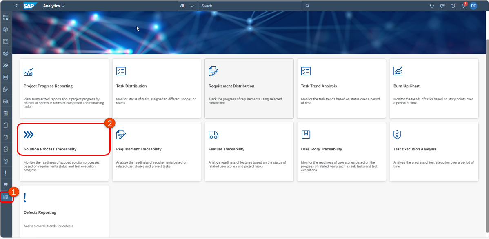
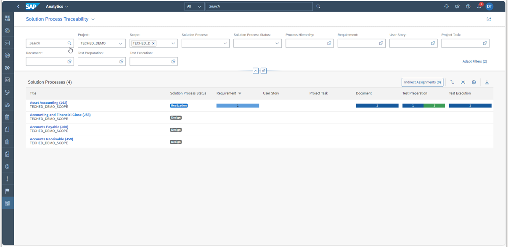
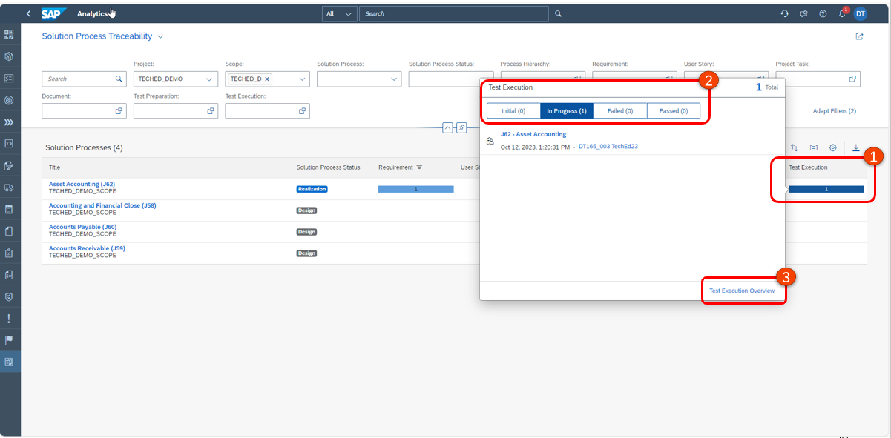
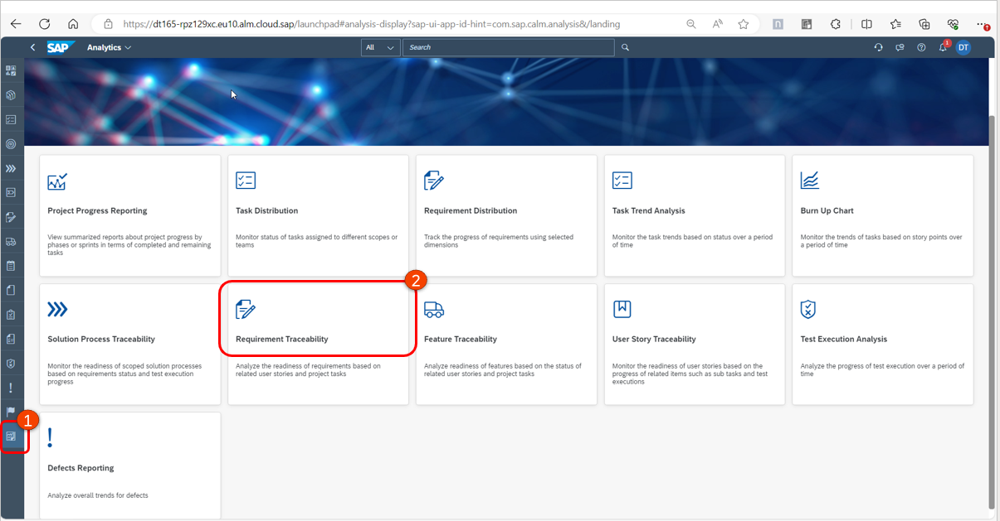
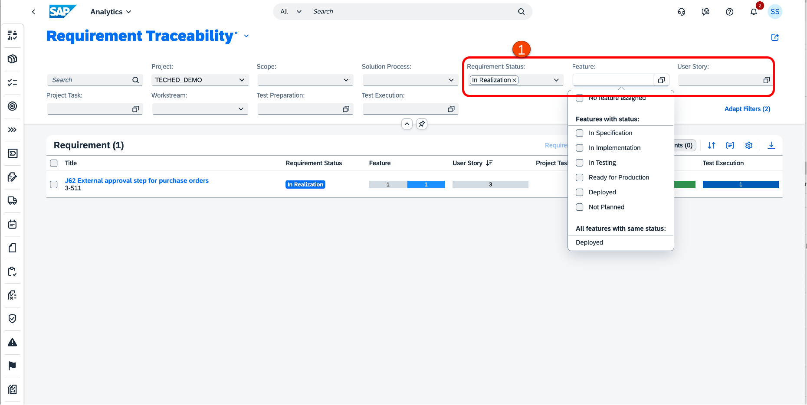

# Excercise 8: Use tracking and traceability analytics

SAP Cloud ALM for Implementation offers multiple options to cover diverse monitoring and reporting needs of different roles and team members. The integrated analytics functionality arches over project management, task management, process management, change and deploy management and test management applications. Each application sends change events to the Analytical framework which processes those events and turns into meaningful information and insights in form of dashboards and reports.

## Excercise 8.1: Use Project Overview Dashboard

The overview page provides a high-level overview of progress in different areas. It acts like a health check monitor for project and at the same time it provides connectivity to other applications for a faster drill down. Each card on overview page represent a specific topic and displays set of relevant information.

1. Ensure you have selected your project and option scope. 
2. You can personalise the overview page by clicking on **Manage Cards**. 
3. To remove a card from the page, use the toggle button. 
4. Click on **OK** to save.

**Use Analytics overview for tracking and traceability dashboards** 

Analytics Overview is a container for detailed analytical standalone pages which help you with a deeper drill down into complex details. Here you will find ready to use progress reports, historical charts, and traceability matrices. 

## Excercise 8.3: Project Progress Reporting 

1. Click on **Analytics**. 
2. Open any of the dashboards eg: **Project Progress Reporting**. 

Here you can review the overall progress of your project in terms of the task completion percentage. Progress of task completion per phase gives an overview of phase progress. 

1. Ensure that the project and scope details are correct. 
2. You can click on the links to see more details. 
3. Change between **tabular** or **chart** view here.

Project progress report shows progress in terms of task completion for phases, sprints and deliverables.  

You can filter the report for scopes, tasks types, priorities teams and user types. Partners can select user type 'partner' to show progress on their side and 'Employee' to see the progress of tasks that are lying with their customer.  

The report outlines total planned tasks, completed tasks and remaining tasks as well as phase wise distribution. Click on the chart icon on the upper right corner to get see the burn down chart of planned remaining tasks versus actual remaining tasks as of today. 

## Excercise 8.4 Solution Process Traceability

With the **Solution Process Traceability** detailed analytical page, you can analyze the readiness of your scoped solution processes based on the progress of related Requirements and Test execution. You can find answers to your questions about the readiness of related entities. 

1. Ensure you are still in Analytics page. 
2. Click on **Solution Process Traceability**.

Here you see all the solution processes scoped as part of your project and check the progress of the related requirements, user stories, tasks, documents, test preparation and execution statuses. 

1. Click on the any of the entities, eg **test execution**. 
2. You will see the associated information; you see the number of test cases still in status **Initial** and **Passed** in this example. 
3. You can also navigate to the **test execution overview** to check the details. 

## Excercise 8.5 Test Management Analytics 

You can use the Requirement Traceability app to understand readiness of requirements based on related user stories and project tasks. 

Let us consider two use cases:  

**Use case 1: Which requirements are ready for test execution?** 

1. Set filters to the below selection criteria:
 - Requirement Status is **In Realization**
 - Feature Status is **In Testing**
 - All User Stories are set to **Done**
 - All Test Cases are set to **Prepared**

**NOTE: You need to have created additional requirements meeting these selection criteria. Please follow the relevant exercises to do this.** 

**Use Case 2: Which Requirements are ready for deployment to production?** 

NOTE: You need to have created additional requirements meeting these selection criteria. Please follow the relevant exercises to do this. 

## Summary 

You have learnt how to use the analytics and traceability dashboards to manage the project efficiently. 

